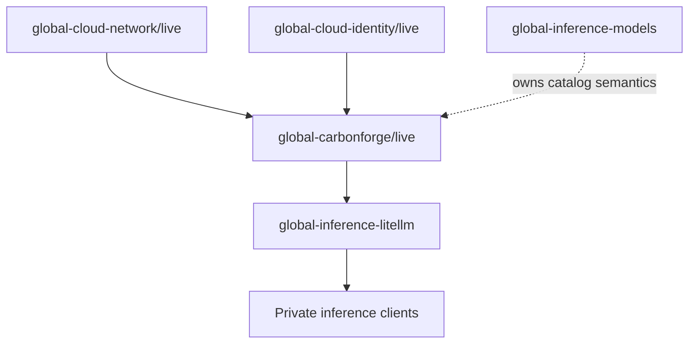

# global-carbonforge

`global-carbonforge` is the Pulumi program for a private, CarbonForge-optimized
AI inference runtime in Jetscale's Global Services AWS account. Its intended
initial workload is the FP8 `Qwen/Qwen3.5-27B-FP8` chat model on one NVIDIA H100,
with an OpenAI-compatible endpoint consumed downstream by
`global-inference-litellm`.

> [!WARNING]
> The private Jakarta H100 now serves direct OpenAI-compatible completions, but
> LiteLLM connectivity and routine Pulumi Deployments remain open. Pulumi still
> proposes replacing the scarce running instance to reconcile corrected user
> data; do not apply that replacement without fresh capacity evidence and explicit
> authorization.

## Status

| Area                   | Current state                                                                                |
| ---------------------- | -------------------------------------------------------------------------------------------- |
| Governance             | Ratified and managed through `../governance`                                                 |
| Infrastructure         | Update 16 provisioned a private Jakarta `p5.4xlarge` and supporting resources                |
| Container supply chain | Private GHCR mirror independently inspected and pinned by digest                             |
| Runtime                | Direct model discovery and an 8-token completion are proven on the Jakarta H100              |
| Tracing                | Disabled pending authoritative destination semantics; `full` remains prohibited              |
| Capacity               | Jakarta P-instance quota is 32 vCPUs; replacement capacity is not currently demonstrated     |
| Deployment             | In-place recovery succeeded; Pulumi user-data reconciliation and managed updates remain open |
| Downstream integration | Private endpoint exported; LiteLLM ingress and routing remain open                           |

## Architecture and dependencies



Direct upstream contracts:

- `JetScale/global-cloud-network/live`: `regionalNetworks`, selected by the
  configured AWS region
- `JetScale/global-cloud-identity/live`: `pulumiOidcProviderArn`,
  `pulumiOidcAudience`

`global-inference-litellm` is a downstream consumer. This program must never
read LiteLLM outputs. `global-inference-models` remains the owner of durable
model-catalog semantics rather than becoming an implementation dependency for
this initial deployment.

## Intended POC runtime

| Setting                       | Value                                                                                                          |
| ----------------------------- | -------------------------------------------------------------------------------------------------------------- |
| Model                         | `Qwen/Qwen3.5-27B-FP8`                                                                                         |
| Private container mirror      | `ghcr.io/jetscale-ai/carbonforge-eval:v0.1.8-v0.1.3`                                                           |
| Immutable container reference | `ghcr.io/jetscale-ai/carbonforge-eval@sha256:a3999f60989e47d9059cfedb0999a2342adb41cad1f20999938ac3a8f4f0d5de` |
| Hardware target               | One NVIDIA H100                                                                                                |
| EC2 shape                     | `p5.4xlarge`                                                                                                   |
| Cost evidence                 | Jakarta-specific runtime cost must be recorded before replacement or continued-operation decisions             |
| Encrypted root volume         | `150 GiB` `gp3`                                                                                                |
| Pinned AMI                    | `ami-06bc172b9832559df` (`Deep Learning Base OSS Nvidia Driver GPU AMI (Ubuntu 22.04) 20260728`)               |
| Private placement             | `subnet-06a995e4116d8061b`, `ap-southeast-3a`                                                                  |
| Public IPv4 / SSH             | Disabled                                                                                                       |
| Tensor parallelism            | `1`                                                                                                            |
| Inspected engine version      | vLLM `0.26.0` from the digest-pinned image                                                                     |
| Maximum model length          | `32768` tokens                                                                                                 |
| GPU memory utilization        | `0.7`                                                                                                          |
| Maximum concurrent sequences  | `4`                                                                                                            |
| Service port                  | `8000`                                                                                                         |
| Scheduler                     | `ltr-promptlen`                                                                                                |
| Model revision                | `97f5941bf617e31c5e237364a8602ce3f03a551a`                                                                     |
| Runtime mode                  | Language model only                                                                                            |
| Reasoning parser              | `qwen3`                                                                                                        |
| Automatic tool choice         | Enabled                                                                                                        |
| Tool-call parser              | `qwen3_coder`                                                                                                  |
| Request tracing               | Disabled until authoritative CarbonForge destination semantics are confirmed                                   |

The host baseline is informed by CarbonForge's public AWS Terraform quickstart,
but adapts it to Jetscale's private-network and secret-handling requirements.
The vendor sample's public IP, SSH, default VPC, CIDR ingress, mutable image tag,
and user-data secrets are explicitly rejected. See the
[Terraform sample assessment](docs/vendor-terraform-assessment.md).

Inspection of the pinned image found that its default command is a dry-run
Qwen2.5 example and that the image does not consume the previously assumed
`CF_SCHEDULER` or `CF_VLLM_MODEL` variables. The generated Compose file therefore
sets an explicit CarbonForge wrapper and vLLM command for the pinned Qwen3.5
model revision, scheduler, port, context, concurrency, parser, and tool settings.
It explicitly sets request tracing to `off` and never passes `--dry-run`.

Bootstrap prefetches the exact public model revision with the image's bundled
`hf download` command and starts vLLM with Hugging Face offline. The prefetch and
runtime share `/root/.cache/huggingface` through `HUGGINGFACE_HUB_CACHE`; without
that setting, offline vLLM cannot find the downloaded snapshot. A dry-run manifest
query measured roughly 33.7 GB of model files; together with the local image, the
encrypted 150 GiB root volume has practical PoC headroom, subject to post-boot
free-space and log-growth checks. Direct compatibility is proven for model
discovery and a bounded completion, but performance is not yet characterized.

## Repository layout

```text
.
├── index.ts                  # Pulumi stack wiring and downstream outputs
├── src/                      # Components, bootstrap, guards, and validation
├── tests/                    # Unit tests for non-provider logic
├── scripts/                  # Auth, encrypted secret entry, Pulumi, and smoke tools
├── docs/                     # Architecture, security, runtime, and runbooks
├── ROADMAP.md                # Delivery phases and acceptance gates
└── AGENTS.md                 # Repository constitution
```

## Development

Install dependencies and run local quality checks:

```bash
pnpm install
pnpm build
pnpm test
pnpm format:check
```

Preview the intended stack through the authenticated wrapper:

```bash
pnpm pulumi preview -s JetScale/global-carbonforge/live
```

Run the bounded private-endpoint smoke test against the provisioned runtime from
an authorized network client:

```bash
CARBONFORGE_BASE_URL=http://PRIVATE_ENDPOINT:8000/v1 pnpm smoke:runtime
```

It verifies model discovery and a fixed chat completion while omitting generated
content from output. See the [verification runbook](docs/runbooks/verification.md).

The `pulumi` script invokes the shared
`../security-governance/scripts/pulumi-with-auth.sh` launcher. Local previews use
the cached `jetscale` IAM Identity Center session and verify the Global Services
account (`728827482753`) plus the `PlatformReadOnly` role. If the session is
expired, run `aws sso login --sso-session jetscale` and retry.

Routine live updates must use Pulumi Deployments. Until CarbonForge's centrally
managed `DeploymentSettings` are complete, an explicitly authorized manual
update of the exact reviewed `main` revision requires the governed, tagged IAM
Identity Center `global-breakglass-admin` path plus
`JETSCALE_ALLOW_LOCAL_LIVE_MUTATION=1`.

## Deployment status and next gates

Pulumi update 16 completed in Jakarta on 2026-08-10. EC2 placement took about 14
minutes, including 832 seconds to create the `p5.4xlarge`. Updates 17 and 18 could
not allocate replacement capacity; create-before-delete preserved the running
instance. Under `INC-002`, the corrected bootstrap was rerun in place through SSM.
The Docker package conflict and mismatched offline Hugging Face cache path were
corrected without replacing the host.

Direct verification on 2026-08-11 proved `/v1/models` HTTP 200 and a bounded chat
completion with HTTP 200, 8 completion tokens, and `finish_reason=length`. The
container remained running with zero restarts, no OOM, and about 55 GiB of GPU
memory in use. Generated content and secrets were not retained in the evidence.

The remaining gates are:

1. Record full storage, driver/CUDA, and log-content inspection evidence.
2. Configure and verify LiteLLM's source-security-group ingress and routing.
3. Confirm request tracing remains off and logs contain no secret or content
   material.
4. Configure routine Pulumi Deployments use of the exported deployment role.
5. Reconcile corrected EC2 user data only when replacement capacity is proven and
   a replacement is explicitly authorized.
6. Record Jakarta-specific cost evidence before any replacement, expansion, or
   continued-operation decision.

See the [deployment runbook](docs/runbooks/deployment.md) and
[verification runbook](docs/runbooks/verification.md) for the operational
sequence.

## Configuration and outputs

`Pulumi.live.yaml` defines non-secret POC metadata, stack references, and the
private GHCR mirror coordinates. The pushed mirror was independently inspected
at GHCR, and `containerDigest` records its registry-reported digest
`sha256:a3999f60989e47d9059cfedb0999a2342adb41cad1f20999938ac3a8f4f0d5de`.
`src/container-config.ts` validates the package, release tag, and digest and
exports the immutable reference shown above. The different vendor source digest
is retained separately as provenance evidence.

A least-privilege `ghcrPullToken` and the CarbonForge licence are stored as
Pulumi-encrypted stack secrets. The obsolete vendor source-registry token has
been removed. The GHCR token must retain only the access needed to read the
private package, normally `read:packages`. Qwen3.5-27B-FP8 is public and requires
no Hugging Face token. Keep secret plaintext out of source files, user data,
logs, and stack outputs.

A human can rotate either secret without placing its value in command arguments:

```bash
pnpm secrets:configure
```

The helper delegates hidden input directly to `pulumi config set --secret`.
Do not reuse values previously shared through unapproved channels.

The applied stack exports `deploymentMaturity: planned-runtime` and a downstream
contract containing the model and revision plus concrete private URL, private IP,
security group ID, and instance ID outputs. The status
`provisioned-after-apply` means infrastructure exists; it is not a health signal.
LiteLLM must reference this stack and create a standalone ingress rule on the
exported CarbonForge security group, sourced from its own ECS task security
group. CarbonForge does not reference LiteLLM.

## Security and operational boundaries

- The provisioned endpoint is private, with no public IPv4 address or public port
  `8000`.
- The CarbonForge security group starts with no ingress. LiteLLM will add TCP
  `8000` ingress sourced only from its ECS task security group.
- Administration uses AWS Systems Manager Session Manager, not SSH ingress.
- Bootstrap materializes secrets from AWS Secrets Manager at runtime with
  restrictive permissions.
- Deployment uses the private GHCR mirror by its independently verified digest,
  not by tag.
- CarbonForge authorization to mirror and operate the proprietary evaluation
  image for this PoC is confirmed.
- Container images and model revisions must be immutable or digest pinned.
- Request tracing is disabled until CarbonForge's destination semantics are
  confirmed. Full traces still require an approved purpose, retention, access,
  and deletion design.

See [`docs/security.md`](docs/security.md),
[`docs/architecture.md`](docs/architecture.md), and
[`docs/runtime-configuration.md`](docs/runtime-configuration.md) for detail.

## Documentation

- [Roadmap](ROADMAP.md)
- [Architecture](docs/architecture.md)
- [Security boundaries](docs/security.md)
- [Runtime configuration](docs/runtime-configuration.md)
- [Runtime invocation blueprint](docs/runtime-invocation.md)
- [CarbonForge Terraform sample assessment](docs/vendor-terraform-assessment.md)
- [Deployment runbook](docs/runbooks/deployment.md)
- [Verification runbook](docs/runbooks/verification.md)

## Non-goals

This repository does not yet prove energy, throughput, latency, quality, cost,
or availability claims. It also does not provision a capacity reservation,
Savings Plan, public service, or production-ready multi-node inference fleet.
The successful initial placement does not guarantee replacement capacity. Future
mutations must recheck regional P-instance quota and physical capacity, preserve
the governed deployment path, and receive explicit cost and live-action approval.

## License

This repository is licensed under the [MIT License](LICENSE).
