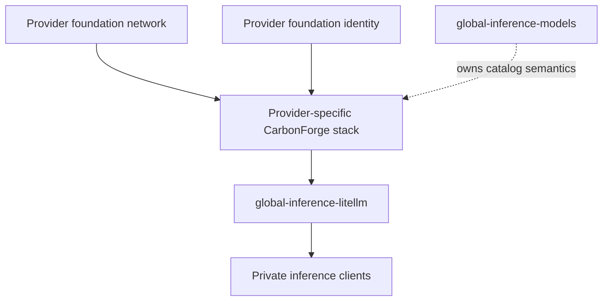

# global-carbonforge

`global-carbonforge` is the Pulumi program for private, CarbonForge-optimized
AI inference runtimes across provider-native cloud foundations. AWS is the only
implemented deployment adapter today; GCP and Azure are explicit, fail-closed
future targets. Its intended initial workload is the FP8 `Qwen/Qwen3.5-27B-FP8` chat model on one NVIDIA H100,
with an OpenAI-compatible endpoint consumed downstream by
`global-inference-litellm`.

> [!WARNING]
> The original Jakarta H100 proved direct OpenAI-compatible completions but was
> subsequently destroyed. N. Virginia and Ohio `us-east-2a` and `us-east-2b`
> then rejected replacement H100 launches for insufficient physical capacity.
> AWS identified `us-east-2c` as the remaining Ohio alternative, so the next
> isolated live attempt targets `us-east-2c`.
> Physical H100 placement, bootstrap verification, LiteLLM connectivity, and
> routine Pulumi Deployments remain open.

## Status

| Area                   | Current state                                                                                           |
| ---------------------- | ------------------------------------------------------------------------------------------------------- |
| Governance             | Ratified and managed through `../governance`                                                            |
| Infrastructure         | Ohio has private subnets and isolated stack configs for `us-east-2a`, `us-east-2b`, and `us-east-2c`    |
| Container supply chain | Private GHCR mirror independently inspected and pinned by digest                                        |
| Runtime                | Historical Jakarta evidence proved direct model discovery and an 8-token completion                     |
| Tracing                | Disabled pending authoritative destination semantics; `full` remains prohibited                         |
| Capacity               | `us-east-2` Running On-Demand P-instance quota is verified at 32 vCPUs; physical capacity is apply-time |
| Deployment             | Partial stack is reconciled; only H100 placement and subsequent verification remain                     |
| Downstream integration | No current endpoint; LiteLLM ingress and routing remain open                                            |

## Architecture and dependencies



Direct upstream contracts:

- `JetScale/global-cloud-network/live`: `regionalNetworks`, selected by the
  configured AWS region
- `JetScale/global-cloud-identity/live`: `pulumiOidcProviderArn`,
  `pulumiOidcAudience`

`global-inference-litellm` is a downstream consumer. This program must never
read LiteLLM outputs. `global-inference-models` remains the owner of durable
model-catalog semantics rather than becoming an implementation dependency for
this initial deployment.

## Intended POC runtime

| Setting                       | Value                                                                                                          |
| ----------------------------- | -------------------------------------------------------------------------------------------------------------- |
| Model                         | `Qwen/Qwen3.5-27B-FP8`                                                                                         |
| Private container mirror      | `ghcr.io/jetscale-ai/carbonforge-eval:v0.1.8-v0.1.3`                                                           |
| Immutable container reference | `ghcr.io/jetscale-ai/carbonforge-eval@sha256:a3999f60989e47d9059cfedb0999a2342adb41cad1f20999938ac3a8f4f0d5de` |
| Hardware target               | One NVIDIA H100                                                                                                |
| EC2 shape                     | `p5.4xlarge` — 16 P-family vCPUs and one H100                                                                  |
| Cost evidence                 | Must be refreshed for the selected region before apply or continued-operation decisions                        |
| Encrypted root volume         | `150 GiB` `gp3`                                                                                                |
| Pinned AMI                    | Regional copy selected by `activePlacement`                                                                    |
| Private placement             | Network-owned private subnet resolved in the selected placement AZ                                             |
| Public IPv4 / SSH             | Disabled                                                                                                       |
| Tensor parallelism            | `1`                                                                                                            |
| Inspected engine version      | vLLM `0.26.0` from the digest-pinned image                                                                     |
| Maximum model length          | `32768` tokens                                                                                                 |
| GPU memory utilization        | `0.7`                                                                                                          |
| Maximum concurrent sequences  | `4`                                                                                                            |
| Service port                  | `8000`                                                                                                         |
| Scheduler                     | `ltr-promptlen`                                                                                                |
| Model revision                | `97f5941bf617e31c5e237364a8602ce3f03a551a`                                                                     |
| Runtime mode                  | Language model only                                                                                            |
| Reasoning parser              | `qwen3`                                                                                                        |
| Automatic tool choice         | Enabled                                                                                                        |
| Tool-call parser              | `qwen3_coder`                                                                                                  |
| Request tracing               | Disabled until authoritative CarbonForge destination semantics are confirmed                                   |

The candidate placement catalog covers every currently offered AZ in the eight
regions with approved 32-vCPU On-Demand P-instance quota and governed networks:

| AWS location | Region           | Selectable placements                                  |
| ------------ | ---------------- | ------------------------------------------------------ |
| N. Virginia  | `us-east-1`      | `us-east-1a` through `us-east-1f`                      |
| Ohio         | `us-east-2`      | `us-east-2a`, `us-east-2b`, `us-east-2c`               |
| Oregon       | `us-west-2`      | `us-west-2a`, `us-west-2b`, `us-west-2c`, `us-west-2d` |
| London       | `eu-west-2`      | `eu-west-2a`, `eu-west-2b`, `eu-west-2c`               |
| Mumbai       | `ap-south-1`     | `ap-south-1a`, `ap-south-1b`, `ap-south-1c`            |
| Tokyo        | `ap-northeast-1` | `ap-northeast-1c`                                      |
| Jakarta      | `ap-southeast-3` | `ap-southeast-3a`                                      |
| São Paulo    | `sa-east-1`      | `sa-east-1c`                                           |

Sydney `ap-southeast-2b` remains cataloged but blocked while its quota appeal
and governed network are incomplete.

“Selectable now” means the placement passes repository prerequisites and has a
committed provider-specific stack configuration; it does not guarantee physical
H100 capacity. A placement without that file fails closed before Pulumi config is
mutated. Once blocked regions gain the required network, quota, and stack
configuration, the same `pnpm placement:select <placement-id>` workflow can cycle
through them without adding another CarbonForge placement definition.

The host baseline is informed by CarbonForge's public AWS Terraform quickstart,
but adapts it to Jetscale's private-network and secret-handling requirements.
The vendor sample's public IP, SSH, default VPC, CIDR ingress, mutable image tag,
and user-data secrets are explicitly rejected. See the
[Terraform sample assessment](docs/vendor-terraform-assessment.md).

Inspection of the pinned image found that its default command is a dry-run
Qwen2.5 example and that the image does not consume the previously assumed
`CF_SCHEDULER` or `CF_VLLM_MODEL` variables. The generated Compose file therefore
sets an explicit CarbonForge wrapper and vLLM command for the pinned Qwen3.5
model revision, scheduler, port, context, concurrency, parser, and tool settings.
It explicitly sets request tracing to `off` and never passes `--dry-run`.

Bootstrap prefetches the exact public model revision with the image's bundled
`hf download` command and starts vLLM with Hugging Face offline. The prefetch and
runtime share `/root/.cache/huggingface` through `HUGGINGFACE_HUB_CACHE`; without
that setting, offline vLLM cannot find the downloaded snapshot. A dry-run manifest
query measured roughly 33.7 GB of model files; together with the local image, the
encrypted 150 GiB root volume has practical PoC headroom, subject to post-boot
free-space and log-growth checks. Direct compatibility is proven for model
discovery and a bounded completion, but performance is not yet characterized.

## Repository layout

```text
.
├── index.ts                  # Pulumi stack wiring and downstream outputs
├── src/core/                 # Provider-neutral deployment and workload contracts
├── src/placements/           # Provider placement catalogs and readiness
├── src/providers/            # Provider-native runtime adapters
├── src/                      # Shared validation and compatibility exports
├── tests/                    # Unit tests for non-provider logic
├── scripts/                  # Auth, encrypted secret entry, Pulumi, and smoke tools
├── docs/                     # Architecture, security, runtime, and runbooks
├── ROADMAP.md                # Delivery phases and acceptance gates
└── AGENTS.md                 # Repository constitution
```

## Development

Install dependencies and run local quality checks:

```bash
pnpm install
pnpm build
pnpm test
pnpm format:check
```

Select a deployment-ready H100 placement and preview the intended stack through
the authenticated wrapper:

```bash
pnpm placement:select us-east-2c
pnpm secrets:configure -- JetScale/global-carbonforge/live-aws-us-east-2c
pnpm pulumi preview --diff -s JetScale/global-carbonforge/live-aws-us-east-2c
```

`placement:select` targets the placement-specific stack and updates both
`global-carbonforge:activePlacement` and `aws:region` from the committed AWS
runtime catalog. Stack names follow
`<environment>-<cloud>-<provider-location>`; the program rejects mismatches
between the stack name and configured placement. During preview, CarbonForge
resolves the selected AZ against `global-cloud-network`'s exported private
subnets; no physical subnet IDs are maintained here. Currently selectable
placements with committed configurations cover every offered AZ in the eight
approved regions listed above. Each isolated stack stores its own encrypted copy
of the shared runtime credentials. Blocked catalog entries fail before mutation
until their quota, governed-network, and committed stack-configuration
prerequisites are met.
Switching placements requires a reviewed preview plus explicit live-action
authorization.

Run the bounded private-endpoint smoke test against the provisioned runtime from
an authorized network client:

```bash
CARBONFORGE_BASE_URL=http://PRIVATE_ENDPOINT:8000/v1 pnpm smoke:runtime
```

It verifies model discovery and a fixed chat completion while omitting generated
content from output. See the [verification runbook](docs/runbooks/verification.md).

The `pulumi` script invokes the shared
`../security-governance/scripts/pulumi-with-auth.sh` launcher. Local previews use
the cached `jetscale` IAM Identity Center session and verify the Global Services
account (`728827482753`) plus the `PlatformReadOnly` role. If the session is
expired, run `aws sso login --sso-session jetscale` and retry.

Routine live updates must use Pulumi Deployments. Until CarbonForge's centrally
managed `DeploymentSettings` are complete, an explicitly authorized manual
update of the exact reviewed `main` revision requires the governed, tagged IAM
Identity Center `global-breakglass-admin` path plus
`JETSCALE_ALLOW_LOCAL_LIVE_MUTATION=1`.

## Deployment status and next gates

Pulumi update 16 placed the original Jakarta H100 on 2026-08-10. Under `INC-002`,
an in-place SSM recovery corrected the Docker package conflict and offline Hugging
Face cache path. Direct verification on 2026-08-11 proved `/v1/models` HTTP 200
and a bounded chat completion with HTTP 200, 8 completion tokens, zero restarts,
no OOM, and about 55 GiB of GPU memory in use. That host was subsequently
destroyed; this remains historical compatibility evidence only.

After AWS reported insufficient `p5.4xlarge` capacity in N. Virginia,
`us-east-2a`, and `us-east-2b`, it identified `us-east-2c` as the remaining Ohio
alternative. The next isolated live configuration targets `us-east-2c` and the
same regional copy of the proven 2026-07-28 DLAMI release. Physical capacity
remains an apply-time dependency in every AZ.

The remaining gates are:

1. Select a ready placement, review the region-migration preview, and record its
   current regional cost.
2. Apply only with explicit authorization, then repeat EC2, SSM, bootstrap,
   driver/CUDA, storage, and token-generation verification on the new host.
3. Configure and verify LiteLLM's source-security-group ingress and routing.
4. Confirm request tracing remains off and logs contain no secret or content
   material.
5. Configure routine Pulumi Deployments use of the exported deployment role.

See the [deployment runbook](docs/runbooks/deployment.md) and
[verification runbook](docs/runbooks/verification.md) for the operational
sequence.

## Configuration and outputs

Each `Pulumi.live-<cloud>-<provider-location>.yaml` defines non-secret POC
metadata, provider foundation references, and private GHCR mirror coordinates. The pushed mirror was independently inspected
at GHCR, and `containerDigest` records its registry-reported digest
`sha256:a3999f60989e47d9059cfedb0999a2342adb41cad1f20999938ac3a8f4f0d5de`.
`src/container-config.ts` validates the package, release tag, and digest and
exports the immutable reference shown above. The different vendor source digest
is retained separately as provenance evidence.

A least-privilege `ghcrPullToken` and the CarbonForge licence are stored as
Pulumi-encrypted stack secrets. The obsolete vendor source-registry token has
been removed. The GHCR token must retain only the access needed to read the
private package, normally `read:packages`. Qwen3.5-27B-FP8 is public and requires
no Hugging Face token. Keep secret plaintext out of source files, user data,
logs, and stack outputs.

A human can rotate either secret without placing its value in command arguments:

```bash
pnpm secrets:configure
```

The helper delegates hidden input directly to `pulumi config set --secret`.
Do not reuse values previously shared through unapproved channels.

The applied stack exports `deploymentMaturity: planned-runtime` and a downstream
contract containing the model and revision plus concrete private URL, private IP,
security group ID, and instance ID outputs. The status
`provisioned-after-apply` means infrastructure exists; it is not a health signal.
Cloud-init publishes `/var/lib/carbonforge/bootstrap-ready` only after bounded
host-local model discovery, token generation, container integrity, and GPU-use
checks pass, but Pulumi does not wait for that marker. The stack consumes the
network-owned `privateInferenceTransport` for its active region, fails closed
unless that peering is active and targets its VPC, and permits TCP `8000` only
from the transport's primary workload VPC CIDR. LiteLLM references this stack but
CarbonForge does not reference LiteLLM, preserving one-way dependencies.

## Security and operational boundaries

- The provisioned endpoint is private, with no public IPv4 address or public port
  `8000`.
- The CarbonForge security group permits TCP `8000` only from the validated
  private workload VPC CIDR exported by `global-cloud-network`; no public CIDR
  or arbitrary configured source is accepted.
- Administration uses AWS Systems Manager Session Manager, not SSH ingress.
- Bootstrap materializes secrets from AWS Secrets Manager at runtime with
  restrictive permissions.
- Deployment uses the private GHCR mirror by its independently verified digest,
  not by tag.
- CarbonForge authorization to mirror and operate the proprietary evaluation
  image for this PoC is confirmed.
- Container images and model revisions must be immutable or digest pinned.
- Request tracing is disabled until CarbonForge's destination semantics are
  confirmed. Full traces still require an approved purpose, retention, access,
  and deletion design.

See [`docs/security.md`](docs/security.md),
[`docs/architecture.md`](docs/architecture.md), and
[`docs/runtime-configuration.md`](docs/runtime-configuration.md) for detail.

## Documentation

- [Roadmap](ROADMAP.md)
- [Architecture](docs/architecture.md)
- [Security boundaries](docs/security.md)
- [Runtime configuration](docs/runtime-configuration.md)
- [Runtime invocation blueprint](docs/runtime-invocation.md)
- [CarbonForge Terraform sample assessment](docs/vendor-terraform-assessment.md)
- [Deployment runbook](docs/runbooks/deployment.md)
- [Verification runbook](docs/runbooks/verification.md)

## Non-goals

This repository does not yet prove energy, throughput, latency, quality, cost,
or availability claims. It also does not provision a capacity reservation,
Savings Plan, public service, or production-ready multi-node inference fleet.
The successful initial placement does not guarantee replacement capacity. Future
mutations must recheck regional P-instance quota and physical capacity, preserve
the governed deployment path, and receive explicit cost and live-action approval.

## License

This repository is licensed under the [MIT License](LICENSE).
