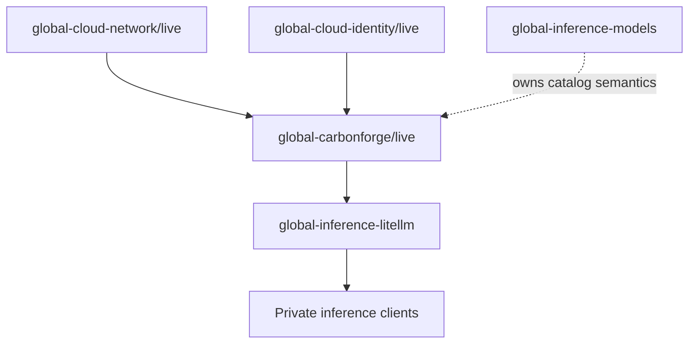

# global-carbonforge

`global-carbonforge` is the Pulumi program for a private, CarbonForge-optimized
AI inference runtime in Jetscale's Global Services AWS account. Its intended
initial workload is the FP8 `Qwen/Qwen3.5-27B-FP8` chat model on one NVIDIA H100,
with an OpenAI-compatible endpoint consumed downstream by
`global-inference-litellm`.

> [!WARNING]
> The private H100 runtime is implemented and has a clean Pulumi preview, but it
> is **not deployed**. The Global Services account currently has a zero On-Demand
> G/VT vCPU quota. A request for 32 vCPUs is tracked in
> [issue #1](https://github.com/Jetscale-ai/global-carbonforge/issues/1), but
> approval does not authorize an apply or guarantee H100 capacity. Do not treat
> preview outputs as a live endpoint or as a benchmark claim.

## Status

| Area                   | Current state                                                                          |
| ---------------------- | -------------------------------------------------------------------------------------- |
| Governance             | Managed through `../governance` with baseline, Pulumi-infra, and node-service bundles  |
| Infrastructure         | Private EC2, IAM, Secrets Manager, security group, and deployment role preview cleanly |
| Container supply chain | Private GHCR mirror independently inspected and pinned by digest                       |
| Runtime                | Explicit inspected-image command, pinned model prefetch, and systemd supervision       |
| Tracing                | Disabled pending authoritative destination semantics; `full` remains prohibited        |
| Capacity               | Blocked: quota `0`; 32-vCPU request open in issue `#1`; one `p5.4xlarge` needs 16      |
| Deployment             | Awaiting quota, capacity recheck, reviewed commit, role bootstrap, and apply approval  |
| Downstream integration | Exports the private endpoint contract; LiteLLM will own its source-SG ingress rule     |

## Architecture and dependencies



Direct upstream contracts:

- `JetScale/global-cloud-network/live`: `regionalNetworks`, selected by the
  configured AWS region
- `JetScale/global-cloud-identity/live`: `pulumiOidcProviderArn`,
  `pulumiOidcAudience`

`global-inference-litellm` is a downstream consumer. This program must never
read LiteLLM outputs. `global-inference-models` remains the owner of durable
model-catalog semantics rather than becoming an implementation dependency for
this initial deployment.

## Intended POC runtime

| Setting                       | Value                                                                                                          |
| ----------------------------- | -------------------------------------------------------------------------------------------------------------- |
| Model                         | `Qwen/Qwen3.5-27B-FP8`                                                                                         |
| Private container mirror      | `ghcr.io/jetscale-ai/carbonforge-eval:v0.1.8-v0.1.3`                                                           |
| Immutable container reference | `ghcr.io/jetscale-ai/carbonforge-eval@sha256:a3999f60989e47d9059cfedb0999a2342adb41cad1f20999938ac3a8f4f0d5de` |
| Hardware target               | One NVIDIA H100                                                                                                |
| EC2 shape                     | `p5.4xlarge`                                                                                                   |
| Cost evidence                 | Must be refreshed for Jakarta before apply; existing Virginia pricing is not regional evidence                 |
| Encrypted root volume         | `150 GiB` `gp3`                                                                                                |
| Pinned AMI                    | `ami-06bc172b9832559df` (`Deep Learning Base OSS Nvidia Driver GPU AMI (Ubuntu 22.04) 20260728`)               |
| Private placement             | `subnet-06a995e4116d8061b`, `ap-southeast-3a`                                                                  |
| Public IPv4 / SSH             | Disabled                                                                                                       |
| Tensor parallelism            | `1`                                                                                                            |
| Inspected engine version      | vLLM `0.26.0` from the digest-pinned image                                                                     |
| Maximum model length          | `32768` tokens                                                                                                 |
| GPU memory utilization        | `0.7`                                                                                                          |
| Maximum concurrent sequences  | `4`                                                                                                            |
| Service port                  | `8000`                                                                                                         |
| Scheduler                     | `ltr-promptlen`                                                                                                |
| Model revision                | `97f5941bf617e31c5e237364a8602ce3f03a551a`                                                                     |
| Runtime mode                  | Language model only                                                                                            |
| Reasoning parser              | `qwen3`                                                                                                        |
| Automatic tool choice         | Enabled                                                                                                        |
| Tool-call parser              | `qwen3_coder`                                                                                                  |
| Request tracing               | Disabled until authoritative CarbonForge destination semantics are confirmed                                   |

The host baseline is informed by CarbonForge's public AWS Terraform quickstart,
but adapts it to Jetscale's private-network and secret-handling requirements.
The vendor sample's public IP, SSH, default VPC, CIDR ingress, mutable image tag,
and user-data secrets are explicitly rejected. See the
[Terraform sample assessment](docs/vendor-terraform-assessment.md).

Inspection of the pinned image found that its default command is a dry-run
Qwen2.5 example and that the image does not consume the previously assumed
`CF_SCHEDULER` or `CF_VLLM_MODEL` variables. The generated Compose file therefore
sets an explicit CarbonForge wrapper and vLLM command for the pinned Qwen3.5
model revision, scheduler, port, context, concurrency, parser, and tool settings.
It explicitly sets request tracing to `off` and never passes `--dry-run`.

Bootstrap prefetches the exact public model revision with the image's bundled
`hf download` command and starts vLLM with Hugging Face offline. A dry-run
manifest query measured roughly 33.7 GB of model files; together with the local
image, the encrypted 150 GiB root volume has practical PoC headroom, subject to
post-boot free-space and log-growth checks. These settings are not compatibility
or performance guarantees until exercised on the target H100.

## Repository layout

```text
.
├── index.ts                  # Pulumi stack wiring and downstream outputs
├── src/                      # Components, bootstrap, guards, and validation
├── tests/                    # Unit tests for non-provider logic
├── scripts/                  # Auth, encrypted secret entry, Pulumi, and smoke tools
├── docs/                     # Architecture, security, runtime, and runbooks
├── ROADMAP.md                # Delivery phases and acceptance gates
└── AGENTS.md                 # Repository constitution
```

## Development

Install dependencies and run local quality checks:

```bash
pnpm install
pnpm build
pnpm test
pnpm format:check
```

Preview the intended stack through the authenticated wrapper:

```bash
pnpm pulumi preview -s JetScale/global-carbonforge/live
```

After a human-authorized deployment, run the bounded private-endpoint smoke test
from an authorized network client:

```bash
CARBONFORGE_BASE_URL=http://PRIVATE_ENDPOINT:8000/v1 pnpm smoke:runtime
```

It verifies model discovery and a fixed chat completion while omitting generated
content from output. See the [verification runbook](docs/runbooks/verification.md).

The wrapper verifies the Global Services account (`728827482753`). It blocks
local `up`, `destroy`, `refresh`, and `import` against `live` unless a human has
explicitly authorized a ticketed `DR014_BREAKGLASS=1` path. Routine live updates
must use Pulumi Deployments.

## Deployment readiness

The implementation is ready for a governed apply only after all of these gates
are satisfied:

1. The effective Jakarta On-Demand P quota remains at least 16 vCPUs; 32 vCPUs
   was verified before this migration.
2. `p5.4xlarge` offering and physical capacity are rechecked in
   `ap-southeast-3a`.
3. The GHCR pull token and CarbonForge licence are confirmed current without
   printing their values.
4. The reviewed changes are landed and a fresh `--diff` preview from that exact
   commit contains only the intended Jakarta creates, regional replacements, and
   IAM policy update.
5. A human explicitly approves the recorded cost and live apply.
6. Existing authority bootstraps this stack's Pulumi Deployments role; Pulumi
   Deployments is then configured to assume the exported `deploymentRoleArn`.
7. A preview under that role confirms its least-privilege policy is sufficient.

Quota approval alone is not a deployment signal. See the
[deployment runbook](docs/runbooks/deployment.md) for the apply and evidence
sequence.

## Configuration and outputs

`Pulumi.live.yaml` defines non-secret POC metadata, stack references, and the
private GHCR mirror coordinates. The pushed mirror was independently inspected
at GHCR, and `containerDigest` records its registry-reported digest
`sha256:a3999f60989e47d9059cfedb0999a2342adb41cad1f20999938ac3a8f4f0d5de`.
`src/container-config.ts` validates the package, release tag, and digest and
exports the immutable reference shown above. The different vendor source digest
is retained separately as provenance evidence.

A least-privilege `ghcrPullToken` and the CarbonForge licence are stored as
Pulumi-encrypted stack secrets. The obsolete vendor source-registry token has
been removed. The GHCR token must retain only the access needed to read the
private package, normally `read:packages`. Qwen3.5-27B-FP8 is public and requires
no Hugging Face token. Keep secret plaintext out of source files, user data,
logs, and stack outputs.

A human can rotate either secret without placing its value in command arguments:

```bash
pnpm secrets:configure
```

The helper delegates hidden input directly to `pulumi config set --secret`.
Do not reuse values previously shared through unapproved channels.

The preview exports `deploymentMaturity: planned-runtime` and a downstream
contract containing the model and revision plus apply-time private URL, private
IP, security group ID, and instance ID outputs. The status
`provisioned-after-apply` is explicit: these values do not exist until an
authorized apply succeeds. LiteLLM must reference this stack and create a
standalone ingress rule on the exported CarbonForge security group, sourced from
its own ECS task security group. CarbonForge does not reference LiteLLM.

## Security and operational boundaries

- The endpoint will be private; no public IPv4 address or public port `8000`.
- The CarbonForge security group starts with no ingress. LiteLLM will add TCP
  `8000` ingress sourced only from its ECS task security group.
- Administration will use AWS Systems Manager Session Manager, not SSH ingress.
- Secrets will be materialized from an approved secret store only at runtime
  with restrictive permissions.
- Deployment uses the private GHCR mirror by its independently verified digest,
  not by tag.
- CarbonForge authorization to mirror and operate the proprietary evaluation
  image for this PoC is confirmed.
- Container images and model revisions must be immutable or digest pinned.
- Request tracing is disabled until CarbonForge's destination semantics are
  confirmed. Full traces still require an approved purpose, retention, access,
  and deletion design.

See [`docs/security.md`](docs/security.md),
[`docs/architecture.md`](docs/architecture.md), and
[`docs/runtime-configuration.md`](docs/runtime-configuration.md) for detail.

## Documentation

- [Roadmap](ROADMAP.md)
- [Architecture](docs/architecture.md)
- [Security boundaries](docs/security.md)
- [Runtime configuration](docs/runtime-configuration.md)
- [Runtime invocation blueprint](docs/runtime-invocation.md)
- [CarbonForge Terraform sample assessment](docs/vendor-terraform-assessment.md)
- [Deployment runbook](docs/runbooks/deployment.md)
- [Verification runbook](docs/runbooks/verification.md)

## Non-goals

This repository does not yet prove energy, throughput, latency, quality, cost,
or availability claims. It also does not provision a capacity reservation,
Savings Plan, public service, or production-ready multi-node inference fleet.
Before any apply, AWS must approve at least 16 On-Demand G/VT vCPUs, physical
capacity must be rechecked, the stack-scoped deployment identity must be
bootstrapped, and a human must explicitly authorize the cost and live action
through the governed deployment path. Those decisions require explicit evidence
and review at the roadmap gates.

## License

This repository is licensed under the [MIT License](LICENSE).
