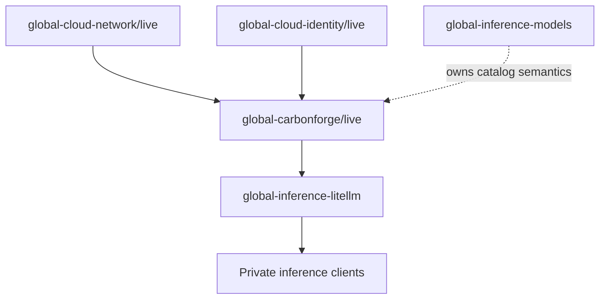

# global-carbonforge

`global-carbonforge` is the Pulumi program for a private, CarbonForge-optimized
AI inference runtime in Jetscale's Global Services AWS account. Its intended
initial workload is the FP8 `Qwen/Qwen3.5-27B-FP8` chat model on one NVIDIA H100,
with an OpenAI-compatible endpoint consumed downstream by
`global-inference-litellm`.

> [!WARNING]
> This repository is currently a **safe Pulumi scaffold**. It creates no AWS
> resources and exposes no inference endpoint. Do not treat its outputs as a
> deployed runtime or a benchmark claim.

## Status

| Area                   | Current state                                                                         |
| ---------------------- | ------------------------------------------------------------------------------------- |
| Governance             | Managed through `../governance` with baseline, Pulumi-infra, and node-service bundles |
| Infrastructure         | Contract-only scaffold; no EC2, IAM, VPC, security group, or secret resources         |
| Runtime                | POC metadata is validated locally; CarbonForge command syntax remains unverified      |
| Tracing                | `normal` only; `full` tracing is rejected by the program                              |
| Downstream integration | Future `global-inference-litellm` consumer; no circular dependency                    |

## Architecture and dependencies



Direct upstream contracts:

- `JetScale/global-cloud-network/live`: `vpcId`, `privateSubnetIds`
- `JetScale/global-cloud-identity/live`: `pulumiOidcProviderArn`,
  `pulumiOidcAudience`

`global-inference-litellm` is a downstream consumer. This program must never
read LiteLLM outputs. `global-inference-models` remains the owner of durable
model-catalog semantics rather than becoming an implementation dependency for
this initial scaffold.

## Intended POC runtime

| Setting                                   | Value                  |
| ----------------------------------------- | ---------------------- |
| Model                                     | `Qwen/Qwen3.5-27B-FP8` |
| Hardware target                           | One NVIDIA H100        |
| Tensor parallelism                        | `1`                    |
| Engine version claimed by source material | vLLM `0.25`            |
| Maximum model length                      | `32768` tokens         |
| GPU memory utilization                    | `0.7`                  |
| Maximum concurrent sequences              | `4`                    |
| Service port                              | `8000`                 |
| Scheduler                                 | `ltr-promptlen`        |
| Request tracing                           | `normal` only          |

These values are POC inputs, not independently validated compatibility or
performance guarantees. The published model context limit and all CarbonForge
runtime flags must be revalidated against authoritative vendor documentation
before deployment.

## Repository layout

```text
.
├── index.ts                  # Contract-only Pulumi program and outputs
├── src/                      # Guards, upstream references, config validation
├── tests/                    # Unit tests for non-provider logic
├── scripts/                  # AWS authentication and guarded Pulumi wrapper
├── docs/                     # Architecture, security, runtime, and runbooks
├── ROADMAP.md                # Delivery phases and acceptance gates
└── AGENTS.md                 # Repository constitution
```

## Development

Install dependencies and run local quality checks:

```bash
pnpm install
pnpm build
pnpm test
pnpm format:check
```

Preview the intended stack through the authenticated wrapper:

```bash
pnpm pulumi preview -s JetScale/global-carbonforge/live
```

The wrapper verifies the Global Services account (`728827482753`). It blocks
local `up`, `destroy`, `refresh`, and `import` against `live` unless a human has
explicitly authorized a ticketed `DR014_BREAKGLASS=1` path. Routine live updates
must use Pulumi Deployments.

## Configuration and outputs

`Pulumi.live.yaml` defines non-secret POC metadata and stack references. Keep
credentials, licence material, registry access, and Hugging Face tokens out of
Pulumi plaintext configuration, source files, user data, logs, and stack
outputs.

The current output contract intentionally says `deploymentMaturity: scaffold`
and returns `null` endpoint fields. Future deployed outputs for LiteLLM are
expected to include a private OpenAI base URL, health URL, model name, workload
security group ID, and instance ID only after private networking and health
checks exist.

## Security and operational boundaries

- The endpoint will be private; no public IPv4 address or public port `8000`.
- Port `8000` will allow only explicitly authorized workload security groups,
  initially LiteLLM ECS tasks.
- Administration will use AWS Systems Manager Session Manager, not SSH ingress.
- Secrets will be materialized from an approved secret store only at runtime
  with restrictive permissions.
- Container images and model revisions must be immutable or digest pinned.
- Normal request traces must exclude prompts and generated content. Full traces
  require an approved purpose, retention, access, and deletion design.

See [`docs/security.md`](docs/security.md),
[`docs/architecture.md`](docs/architecture.md), and
[`docs/runtime-configuration.md`](docs/runtime-configuration.md) for detail.

## Documentation

- [Roadmap](ROADMAP.md)
- [Architecture](docs/architecture.md)
- [Security boundaries](docs/security.md)
- [Runtime configuration](docs/runtime-configuration.md)
- [Deployment runbook](docs/runbooks/deployment.md)
- [Verification runbook](docs/runbooks/verification.md)

## Non-goals

This repository does not yet prove energy, throughput, latency, quality, cost,
or availability claims. It also does not provision a capacity reservation,
Savings Plan, public service, or production-ready multi-node inference fleet.
Those decisions require explicit evidence and review at the roadmap gates.

## License

This repository is licensed under the [MIT License](LICENSE).
