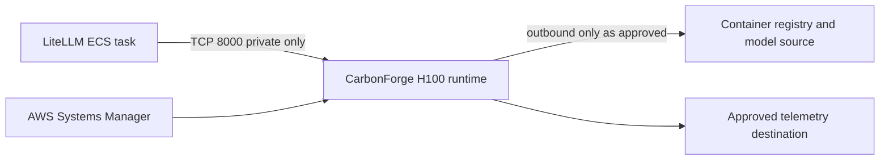

# Architecture

## Scope

`global-carbonforge` owns the private H100 compute, inference workload security
group, runtime bootstrap, health contract, and endpoint outputs for a
CarbonForge-optimized model runtime. Pulumi update 16 provisioned these resources
in Jakarta on 2026-08-10. Runtime health and downstream reachability remain
unverified until the post-deploy checks pass.

## Dependency graph

| Repository                 | Direction          | Contract                                                       |
| -------------------------- | ------------------ | -------------------------------------------------------------- |
| `global-cloud-network`     | Upstream           | Existing VPC and private subnet IDs                            |
| `global-cloud-identity`    | Upstream           | Pulumi Cloud OIDC provider ARN and audience                    |
| `global-inference-models`  | Ownership boundary | Durable model-catalog semantics; not an initial StackReference |
| `global-inference-litellm` | Downstream         | Private endpoint and model contract after deployment           |

The program must not create a parallel VPC, duplicate the shared model catalog,
or read outputs from LiteLLM. The latter avoids a circular dependency.

## Intended network boundary

The H100 workload is private, has no public IPv4 address, and exposes no SSH.
Its security group starts with no ingress. After CarbonForge is deployed,
LiteLLM creates a standalone TCP `8000` ingress rule targeting the exported
CarbonForge security group and sourced from its own ECS task security group.
This keeps stack dependencies one-way. Administration uses Systems Manager
Session Manager.

## Container supply chain

The selected `linux/amd64` evaluation image is mirrored privately at
`ghcr.io/jetscale-ai/carbonforge-eval`. The Pulumi configuration records both its
fixed release tag and the independently inspected GHCR digest
`sha256:a3999f60989e47d9059cfedb0999a2342adb41cad1f20999938ac3a8f4f0d5de`.
The program exports a digest-pinned immutable reference; the release tag is
provenance metadata, not the deployment selector.

The GHCR digest differs from the vendor source-registry digest. Both are retained
as separate provenance facts. Runtime access uses a least-privilege GHCR pull
token rather than the temporary vendor source credential.

## Vendor-informed host baseline

CarbonForge's public AWS Terraform sample confirms `p5.4xlarge` as its minimal
one-H100 client host, an NVIDIA Deep Learning AMI family, and a 150 GiB encrypted
root volume. The applied regional deployment pins Jakarta AMI
`ami-06bc172b9832559df` and private subnet `subnet-06a995e4116d8061b` in
`ap-southeast-3a`. The effective Jakarta Running On-Demand P-instance quota is 32
vCPUs, and the 16-vCPU `p5.4xlarge` was placed successfully. That launch does not
guarantee future replacement capacity. Jakarta-specific cost evidence remains
required for lifecycle decisions.

The sample is intentionally minimal and public-facing. This architecture does
not adopt its default VPC, public IPv4, SSH key, CIDR ingress, user-data secrets,
most-recent AMI lookup, or mutable container tag. The full pattern-by-pattern
analysis is in
[`vendor-terraform-assessment.md`](vendor-terraform-assessment.md).

## Downstream output contract

The stack exports the narrow non-secret contract LiteLLM needs:

- `openAiBaseUrl`: private OpenAI-compatible base URL;
- `healthUrl`: private health endpoint;
- `modelName` and `modelRevision`: pinned serving-model identity;
- `securityGroupId`: workload security group for consumer ingress rules; and
- `instanceId`: operational identity for SSM and alarms.

The applied stack reports concrete endpoint and resource outputs while retaining
`deploymentMaturity: planned-runtime`. The downstream status is
`provisioned-after-apply`, which confirms infrastructure provisioning rather than
runtime health. Consumers must not treat the contract as reachable until runtime
verification succeeds.

## Deployment identity

`global-cloud-identity` owns the Pulumi Cloud OIDC provider. This stack creates
its own stack-scoped Pulumi Deployments role trusted only for
`pulumi:deploy:org:JetScale:project:global-carbonforge:stack:live:*`. It does not
own or change the central OIDC anchor. IAM and Secrets Manager permissions are
name/account scoped; EC2 launch and describe permissions retain AWS-required
wildcard resources.

The initial break-glass apply crossed the first-deployment bootstrap boundary and
created the role that the stack itself manages. Pulumi Deployments must now assume
the exported `deploymentRoleArn`, and a preview under that role must verify that
its policy covers the complete program before routine applies use it.
