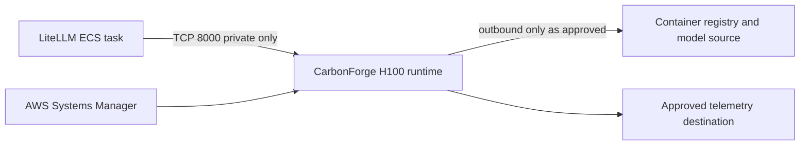

# Architecture

## Scope

`global-carbonforge` owns provider-specific private H100 compute, workload
firewall identity, runtime bootstrap, health contract, and endpoint outputs for
a CarbonForge-optimized model runtime. The provider-neutral layer defines
placement, workload, and downstream contracts; provider adapters retain native
network, identity, secret, and administration semantics. AWS is currently the
only implemented adapter. After insufficient-capacity responses in N. Virginia
and Ohio `us-east-2a` and `us-east-2b`, the next isolated live configuration
targets `us-east-2c`. Additional regional candidates are cataloged for attended
capacity cycling as their network and quota prerequisites permit. The original
Jakarta host is destroyed and
remains historical compatibility evidence. Current runtime health and downstream
reachability require a successful new deployment and post-deploy verification.

## Dependency graph

| Repository                 | Direction          | Contract                                                       |
| -------------------------- | ------------------ | -------------------------------------------------------------- |
| `global-cloud-network`     | Upstream           | Existing VPC and private subnet IDs                            |
| `global-cloud-identity`    | Upstream           | Pulumi Cloud OIDC provider ARN and audience                    |
| `global-inference-models`  | Ownership boundary | Durable model-catalog semantics; not an initial StackReference |
| `global-inference-litellm` | Downstream         | Private endpoint and model contract after deployment           |

The program must not create a parallel VPC, duplicate the shared model catalog,
or read outputs from LiteLLM. The latter avoids a circular dependency.

## Cross-cloud deployment boundary

Deployment stacks use
`<environment>-<cloud>-<provider-location>`, for example
`live-aws-us-east-2a`. Each stack owns exactly one provider placement. This
allows candidate deployments to coexist and be verified independently; changing
cloud provider never transforms one provider's resources into another's.

The portable workload bootstrap consumes a protected registry-token file and a
protected licence file. Provider adapters are responsible for securely
materializing those files with AWS Secrets Manager and an instance role, GCP
Secret Manager and a service account, or Azure Key Vault and managed identity.
Only the AWS materialization path exists today. GCP and Azure stack names fail
closed until their adapters and upstream foundations are implemented.

All adapters must return the same non-secret deployment contract: cloud,
placement ID, instance ID, private IP, OpenAI base URL, health URL, and provider
firewall identity. The legacy AWS `securityGroupId` output remains available to
AWS consumers during migration.

An infrastructure update does not activate a deployment. A separate downstream
registry or routing owner must promote a full stack reference only after health,
model discovery, bounded completion, GPU, and LiteLLM connectivity evidence is
recorded. See the [draft cross-cloud decision](decisions/DR-001-ARCHITECTURE-DRAFT-cross-cloud-runtime-deployments.md).

## Intended network boundary

The H100 workload is private, has no public IPv4 address, and exposes no SSH.
`global-cloud-network` owns the inter-region VPC peering and private routes.
CarbonForge validates that the active transport targets its regional VPC and
originates in the primary `us-east-1` workload VPC, then creates a standalone TCP
`8000` ingress rule sourced only from that private VPC CIDR. LiteLLM reads the
resulting endpoint contract without being referenced upstream, preserving
one-way dependencies. Administration uses Systems Manager Session Manager.

## Container supply chain

The selected `linux/amd64` evaluation image is mirrored privately at
`ghcr.io/jetscale-ai/carbonforge-eval`. The Pulumi configuration records both its
fixed release tag and the independently inspected GHCR digest
`sha256:a3999f60989e47d9059cfedb0999a2342adb41cad1f20999938ac3a8f4f0d5de`.
The program exports a digest-pinned immutable reference; the release tag is
provenance metadata, not the deployment selector.

The GHCR digest differs from the vendor source-registry digest. Both are retained
as separate provenance facts. Runtime access uses a least-privilege GHCR pull
token rather than the temporary vendor source credential.

## Vendor-informed host baseline

CarbonForge's public AWS Terraform sample confirms `p5.4xlarge` as its minimal
one-H100 client host. The shape consumes 16 P-family vCPUs and uses an NVIDIA
Deep Learning AMI with a 150 GiB encrypted root volume. The active placement
selects a pinned regional copy of the proven 2026-07-28 release and resolves a
private subnet from `global-cloud-network`.

The runtime catalog covers every currently offered AZ in N. Virginia, Ohio,
Oregon, London, Mumbai, Tokyo, Jakarta, and São Paulo. Those eight regions have
approved 32-vCPU On-Demand P-instance quota, governed private networks, pinned
regional AMIs, and isolated stack configurations. Sydney `ap-southeast-2b`
remains cataloged but blocked while its quota appeal and network are incomplete.
Offering and quota evidence do not guarantee physical H100 capacity at launch;
regional cost evidence remains required.

The sample is intentionally minimal and public-facing. This architecture does
not adopt its default VPC, public IPv4, SSH key, CIDR ingress, user-data secrets,
most-recent AMI lookup, or mutable container tag. The full pattern-by-pattern
analysis is in
[`vendor-terraform-assessment.md`](vendor-terraform-assessment.md).

## Downstream output contract

Each deployment stack exports the narrow non-secret contract LiteLLM needs:

- `cloud` and `placementId`: immutable deployment coordinates;
- `openAiBaseUrl`: private OpenAI-compatible base URL;
- `healthUrl`: private health endpoint;
- `modelName` and `modelRevision`: pinned serving-model identity;
- `firewallIdentity`: provider-native workload firewall identity;
- `securityGroupId`: transitional AWS security-group identity; and
- `instanceId`: operational identity for SSM and alarms; and
- `networkContract.privateInferenceTransport`: the validated network-owned
  peering and CIDR contract used by the runtime ingress rule.

The applied stack reports concrete endpoint and resource outputs while retaining
`deploymentMaturity: planned-runtime`. The downstream status is
`provisioned-after-apply`, which confirms infrastructure provisioning rather than
runtime health. First boot atomically publishes
`/var/lib/carbonforge/bootstrap-ready` after host-local model discovery, token
generation, container integrity, and GPU-use checks pass; Pulumi does not wait
for that marker. Consumers must not treat the contract as reachable until
runtime verification succeeds.

## Deployment identity

`global-cloud-identity` owns the Pulumi Cloud OIDC provider. This stack creates
its own stack-scoped Pulumi Deployments role trusted only for
the exact provider-specific stack, for example
`pulumi:deploy:org:JetScale:project:global-carbonforge:stack:live-aws-us-east-2a:*`. It does not
own or change the central OIDC anchor. IAM and Secrets Manager permissions are
name/account scoped; EC2 launch and describe permissions retain AWS-required
wildcard resources.

The initial break-glass apply crossed the first-deployment bootstrap boundary and
created the role that the stack itself manages. Pulumi Deployments must now assume
the exported `deploymentRoleArn`, and a preview under that role must verify that
its policy covers the complete program before routine applies use it.
