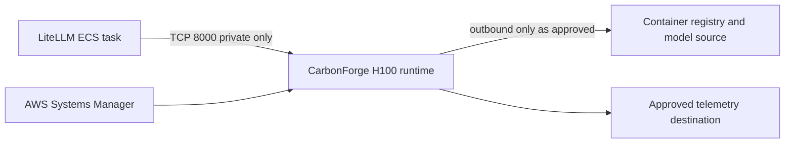

# Architecture

## Scope

`global-carbonforge` will own the private H100 compute, inference workload
security group, runtime bootstrap, health contract, and endpoint outputs for a
CarbonForge-optimized model runtime. The current Pulumi program is intentionally
contract-only and creates none of those resources.

## Dependency graph

| Repository                 | Direction          | Contract                                                       |
| -------------------------- | ------------------ | -------------------------------------------------------------- |
| `global-cloud-network`     | Upstream           | Existing VPC and private subnet IDs                            |
| `global-cloud-identity`    | Upstream           | Pulumi Cloud OIDC provider ARN and audience                    |
| `global-inference-models`  | Ownership boundary | Durable model-catalog semantics; not an initial StackReference |
| `global-inference-litellm` | Downstream         | Private endpoint and model contract after deployment           |

The program must not create a parallel VPC, duplicate the shared model catalog,
or read outputs from LiteLLM. The latter avoids a circular dependency.

## Intended network boundary

The eventual H100 workload is private. It must have no public IPv4 address and
must not expose SSH. Port `8000` is limited to explicitly authorized workload
security groups, initially the LiteLLM ECS task security group. Administration
uses Systems Manager Session Manager.

## Future output contract

Once a runtime exists and passes verification, exports for the LiteLLM consumer
may include:

- `openAiBaseUrl`: private OpenAI-compatible base URL;
- `healthUrl`: private health endpoint;
- `modelName`: pinned serving model identifier;
- `securityGroupId`: workload security group for consumer ingress rules; and
- `instanceId`: operational identity for SSM and alarms.

Until then, the scaffold returns `deploymentMaturity: scaffold`, `null` endpoint
fields, and validated configuration metadata. Consumers must reject that
non-deployed contract.

## Deployment identity

`global-cloud-identity` owns the Pulumi Cloud OIDC provider. This stack may
later create its own least-privilege, stack-scoped deployment role trusted by
that provider. It does not own or change the central OIDC anchor.
